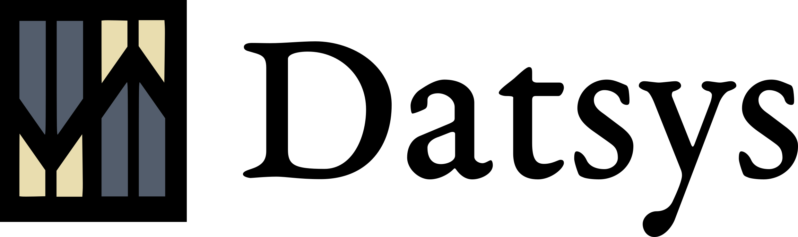

(Formerly Catalysis)

<br/>

## A web application development framework embracing:

* Unidirectional flow of derived data & generally the power of the stream processing model for concurrency and distribution on the server and client (a la [Re-frame](https://github.com/Day8/re-frame), Elm, Redux, Samza)
* The vision described in the Web After Tomorrow: Scoped Datomic/DataScript database sync as a model for state management and communication
* The power of the Datom model, datalog and pull-expressions, and the power
* Stuart Sierra's system component model + protocols & specs for system modularity (Arachne module ready eventually hopefully as well)

See the talk from Clojure/West 2016: [Datalog all the way down](https://www.youtube.com/watch?v=aI0zVzzoK_E)

[](https://gitter.im/metasoarous/datsys?utm_source=badge&utm_medium=badge&utm_campaign=pr-badge&utm_content=badge)

<br/>

## System (Component) architecture

Datsys is built out of the following libraries:

* [Datsync](https://github.com/metasoarous/datsync): Humble basis upon which we may approach the Web After Tomorrow; `Datomic <-> DataScript` sync utilities
* Datview: Reusable Reagent components for dynamically and flexibly translating data in a Datomic or DataScript database into UI representations and forms, input, and controls.
* Datreactor: Re-frame style event handling transaction coordination for DataScript connections.
* Datspec: Specifications, protocols and lib version coordination for Dat`*` systems.

It is all of these things and none of these things.
It is whichever of them you decide to hook up.

Each of these libraries has been designed around a set of system abstractions, declared as protocols.
These protocols define an abstraction over the shape of the various system components in the overall architecture.
The goal is that it be possible to swap implementations in and out depending on what pieces are needed for a particular application.
(So far this system modularization only extends as far as the client, since that's where most of the code is.
 However, the server will end up following this pattern as well.)

Let's take a look at `dat.sys.client.app`:

```clj
(defn new-system []
  (-> (component/system-map
        ;; Remote is our main server connection
        :remote     (sente/new-sente-remote)
        ;; For dispatching event streams to the reactor
        :dispatcher (dispatcher/new-strictly-ordered-dispatcher)
        ;; Remote is our main server connection
        :app        (component/using
                      (dat.view/new-datview)
                      [:remote :dispatcher])
        :reactor    (component/using
                      (reactor/new-simple-reactor)
                      [:remote :dispatcher :app])
        :datsync    (component/using
                      (dat.sync/new-datsync)
                      [:remote :dispatcher]))))
```

This describes a system that is syncing a DataScript database on a client with (most likely) a Datomic database on a server, with messages transmitted by a default Sente-based implementation of the Remote abstraction's protocol(s).
This DataScript database then feeds a view using the datview component `:app`.
The one core piece in orchestrating all of this is the reactor and the dispatcher.
Together these manage the flow of events and their updates on the app state, as well as orchestrate side effects.

Since these pieces are modular, you could just use the reactor and dispatcher, but nothing else.
Or you could use that plus Datsync, but not use Datview.
Or use Datview, but not Datsync.
Or use DataScript on the server instead of Datomic.
Or whatever.

The goal is for this to be flexible enough to describe a lot of different systems within the general span of this set of pieces.
So if it isn't working for you let us know.

(Aside: Why haven't people been building system components on top of protocols abstracting subsystem boundaries more?)

Of course, as the name might suggest, we'll also be building specs into this project.
So that'll be another nice layer of expressiveness open to us for describing subsystem boundaries.

<br/>


## Usage

To get running, clone, and cd into the project directory (`datsys`).

```
lein repl
```

Wait for the prompt, then type

```clj
(run)
```

This will initialize a `system` var in the `user` ns, bind the new system instance to it, and then start that system (see Stuart Sierra's Component for more information about systems and components in this sense).

If you need to reset the system, call `reset`.
You can also call something like `(run {:server {:port 8882}})` to specify config overrides.
The schema for this is in `datsys.config`.
Unfortunately, not sure yet how to get the `reset` function to also accept the `config-overrides` option.

And maybe eventually we'll also helpers for running multiple instances at once to test different things...
But one step at a time :-)

### Browser Repl

You can get the browser-connected figwheel repl with the command:

```clj
(browser-repl)
```

And return to the server repl with:

```clj
:cljs/quit
```


### Open Browser

Next, point browser to:
<http://localhost:2358> (or whatever you set $PORT to)
You should see a page that says "Congrats! You've got a datsys app running :-)".

After a few seconds or so, once connections have established and data transacted, you should see a todo list render.
If not, check your console.
(Actually, right now there's a bug and it's possible nothing shows up; You can save a file to get figwheel to trigger an update, but we should have a real fix soon).

<br/>


## Customizing your app

Yay!
If you've gotten through the Usage section, you have a running system with some data loaded and ready to tinker with!
At this point, you might want to look at the Todo app a little bit to feel out how things work.


### Schema & Seed data

Because of the seamless shuttling of data back and forth between server and client, much of the customization work to do on the server is in the schema.

The schema file is located in `resources/schema.edn`.
The data in this file is a [conformity](https://github.com/rkneufeld/conformity) spec, so you can continue to use this same file for all your migrations.
If you want to see how these migrations are hooked up, take a look at the `dat.sys.datomic/Datomic` component.

There's also some seed data in `resources/test-data.edn` for you to play with.


### Front end

Views are in `dat.sys.client.views`, and you'll note that the `main` function there is hooked up at the end of the `dat.sys.client.app` namespace (where we created our system).

The view code is written in a combination of [Reagent](https://github.com/reagent-project/reagent) and [Posh](https://github.com/mpdairy/posh) within the context of the [Datview](https://github.com/metasoarous/datview) UI toolkit.
More or less, Datview is a set of helper functions for translating queries and/or query data into hiccup (and thus DOM).
These functions vary in granularity (`pull-view > attribute-view > value-view`), letting you compose things as you see fit.
Additionally, there is a notion of rendering data within an abstract _context_ with instructs a particular Datview component function how to do it's job.
As such, the semantics of a particular context map depend on the function in which it's being used.
And actually, under the hood, these will all just be mapping to some general purpose function: `(transform datview-app context data)`.
This itself, in turn, may call `(transform datview-app sub-context sub-data)`, recursively.
The context should optimally be DataScript data, so that different views can just be different base context values created from within the database.
The `transform` function then can just be a multimethod on the structure of this data.
Or if you wanted to, you could use pattern matching.
(For more information please see the Datview README.)

So aside from constructing context specifications (and wiring/composing them together), you'll also have to handle events and trigger side effects.
To read more about this, see [Datreactor](https://github.com/metasoarous/datreactor).
If you are using [Datsync](https://github.com/metasoarous/datsync), there's a Datremote abstraction you can use for coordinating messages with the synchronization channels.
More information about hooking those thing up can be found in their respective repositories, and see whatever code samples are provided with this project template.

### Other stuff

Reactions... etc

<br/>


## Contributing to Datsys (and other Dat\* projects)

We would love your help!
Anything from filing bug reports, to documentation, to hacking on code is infinitely appreciated.
For docs, feel free to contribute directly to the wiki.
For code or code-comment/README docs, feel free to submit a pull-request.
Before you start working on anything big though please get in touch with us about it using either a github issue, or by reaching out to us on the Gitter channel.

### Dealing with multiple repos

If you're contributing code to one of the other Dat projects, you'll likely want to use the [Checkout dependencies](https://github.com/technomancy/leiningen/blob/master/doc/TUTORIAL.md#checkout-dependencies) feature of Leiningen.
In short, clone whatever projects you're working on into a `checkouts` dir in `datsys` (note: linking will not work if you want client reloading via Figwheel).
Be aware of the caveats listed in the link above.

### Roadmap

There's obviously also a ton smaller things that need to be done and fixed, and you can take a look at project issues for those.
But the following is a very big picture overview of some of the more major things we'd like to accomplish with the system.

* Datsync:
    * Security and scoping filters (+ posh query exports for automated scoping)
    * Offline availability
    * Entity validations
    * Onyx distribution
    * Long term:
        * P2P (non-centralized) distribution/sharing (perhaps via CRDTs or CVDCS)
        * Log history plugins
* Datview:
    * Rewrite in terms more general `(transform app context data)` context-based translation function, with multimethod dispatching for extensible rendering.
    * Finish setting up default context hooks/implementations.
    * Build out more default control widgets and clean way of grouping them.
    * Documentation
    * Package together some example widgets (as context multimethod implementations).
* Datspec
    * Add Clojure spec hotness to abstract architectural descriptions :-) (and generally spec rest of project(s) as well)
* Datsys:
    * Documentation
    * More example apps
    * System Componentization of server, similar to what we've done for client:
      Going to be a little more challenging here since the flow of data is a bit more complicated, and scalability more of a concern.
      But we should still be able to come up with some nice abstractions so folks can switch out different implementations.
    * Generative testing (based on specs)

<br/>


## Environment and Deployment

### Config

This application uses a system configuration component found in `dat.sys.config`.
There's a default settings map there you can edit, and all settings are customizable via environment variables or run time arguments.
Feel free to extend this for your needs to keep all your config logic in one place.
Or replace with whatever you like here.
We may move to a proper library for doing this.

### Datomic Pro

Assuming you want to use the free version of Datomic to test things out, things _should_ run out of the box here.
There's a partial description in the wiki of how to get Datomic Pro set up with this application, should you need it (as well as some commented code in the project.clj).

### Deploying to Heroku

(Disclaimer: I haven't tried this; copied from Rente.)

To make Datsys run on Heroku, you need to let Leiningen on Heroku use the "package" build task.

To do this, and point Leiningen on Heroku to the "package" target, add the following config variable to Heroku by running this command:

```
heroku config:add LEIN_BUILD_TASK=package
```

Everything is nicely wrapped in shiny purple foil if you simply click this button:

[](https://heroku.com/deploy)

Enjoy!

### Mobile App?

There's been talk of folks starting to use this in mobile apps.
I've you've been using it for mobile apps, please write about it (blog post, tweet, GH wiki page, whatevs) and PR a link here or message me.

## More coming soon...

* Datsys as an Arachne plugin?


## Contributions

This code was initially developed as a fork of Rente, but has diverged.
We thank the authors of Rente for their contribution.

This library is authored by Christopher T. Small, with the contributions from the following individuals:

Kyle Langford

See LICENSE for license.


