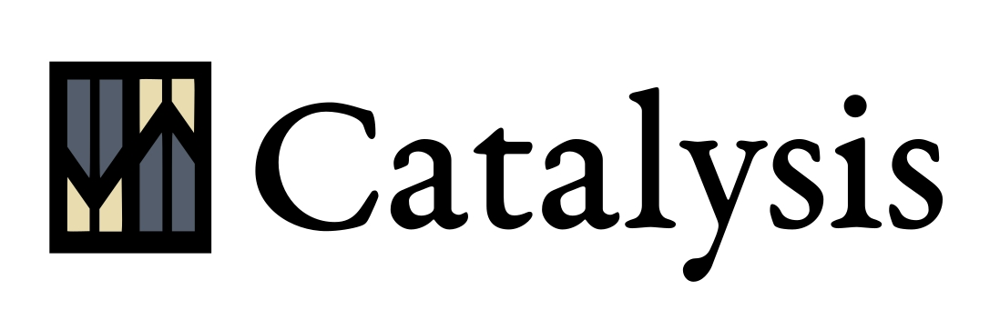

Full stack `(+ datsync datview posh datomic datascript #?(:maybe-future [onyx]))` accelerated clj/cljs reactive web development.


<br/>

[](https://gitter.im/metasoarous/catalysis?utm_source=badge&utm_medium=badge&utm_campaign=pr-badge&utm_content=badge)

<br/>


## Introduction

Catalysis is a full stack web application template with:

* [Re-frame](https://github.com/Day8/re-frame)/Samza data flow all the way down
* full database replication between a central Datomic server and remote DataScript client servers via Datsync (optimistic updates coming soon)
* composable, data-driven view/query specifications a la [Posh](https://github.com/mpdairy/posh) & [Datview](src/datview/README.md) (see below).

In a sense it is a restricted realization of Nikita Prokopov's [The Web After Tomorrow](http://tonsky.me/blog/the-web-after-tomorrow/) vision.
While currently limited, it provides a basis on which we can build out this vision, and the patterns it enables.

See the talk from Clojure/West 2016: [Datalog all the way down](https://www.youtube.com/watch?v=aI0zVzzoK_E)


## Datview

Of mention, this template stands as a staging ground for [Datview](src/datview/README.md).
Datview is a pattern for declaratively and composably specifying how Datomic/DataScript data should translate into Reagent components.

In short, we're building upon the following:

* Maximized potential of Datomic/DataScript for declarative query specifications.

For a detailed introduction to Datview, please see [src/datview/README.md](src/datview/README.md).


### Current state

The application is currently loading data from datomic and rendering some simple views based on this data.
Client -> Server write examples should be coming soon.
For right now at least, this serves as an example setup of [datsync](https://github.com/metasoarous/datsync) data flow, Datview & Posh


## Usage

To get running, clone, and cd into the project directory (`catalysis`).


### Figwheel

Next get figwheel up and running for hot cljs reloading:

```
lein figwheel
```

Wait for figwheel to finish and notify browser of changed files!


### Server

Then in another terminal tab (tmux pane, whatevs...):

```
lein repl
```

Wait for the prompt, then type

```
(ns user)
(run)
```

This will initialize a `system` var in the `user` ns, bind the new system instance to it, and then start that system (see Stuart Sierra's Component for more information about systems and components in this sense).

If you need to reset the system, call `reset`.
You can also call something like `(run {:server {:port 8882}})` to specify config overrides.
The schema for this is in `catalysis.config`.
Unfortunately, not sure yet how to get the `reset` function to also accept the `config-overrides` option.

And maybe eventually we'll also helpers for running multiple instances at once to test different things...
But one step at a time :-)


### Open Browser

Next, point browser to:
<http://localhost:2358> (or whatever you set $PORT to)
You should see a page that says "Congrats! You've got a catalysis app running :-)".

After a few seconds or so, once connections have established and data transacted, you should see a todo list render.
If not, check out your console.

<br/>


## Customizing your app

Yay!
If you've gotten through the Usage section, you have a running system with some data loaded and ready to tinker with!
At this point, you might want to tinker around with the Todo app a little bit to feel out how things work.
But you'll surely soon want to start reshaping things into your own project.


### Config

This application uses a system configuration component found in `catalysis.config`.
There's a default settings map there you can edit, and all settings are customizable via environment variables or run time arguments.
Feel free to extend this for your needs to keep all your config logic in one place.


### Schema & Seed data

Because of the seamless shuttling of data back and forth between server and client, much of the customization work to do on the server is in the schema.

The schema file is located in `resources/schema.edn`.
The data in this file is a [conformity](https://github.com/rkneufeld/conformity) spec, so you can continue to use this same file for all your migrations.
If you want to see how these migrations are hooked up, take a look at the `catalysis.datomic/Datomic` component.

There's also some seed data in `resources/test-data.edn` for you to play with.


### Front end components

The main namespace for the client is `catalysis.client.app`.
This is where everything hooks together.
We may eventually set up Stuart Sierra's component here as well, but for now, think of this as your system bootstrap process.

Views are in `catalysis.client.views`, and you'll note that the `main` function there is hooked up at the end of the `app` namespace.
This is where you write your view code.

This view code is written in a combination of [Reagent](https://github.com/reagent-project/reagent) and Posh, upon which [Datview](src/datview/README.md) is based, and there's a lot to learn for each of these.
The long and short of it though is that posh lets us write Reagent reactions as DataScripts queries (`q`, `pull`, `pull-many`, `filter-pull`, `filter-q`, etc.).
Thus, we obtain the re-frame "reactive materialized views" architecture with declarative query descriptions, al. a DataScript databases.

Datview (mentioned above) is merely a pattern for using query metadata to instruct the translation of DataScript into DOM via these functions.
We'll be building out these patterns more, and making them in to a library.
But for now, it's something to see in motion.


### Datomic Pro

Assuming you want to use the free version of Datomic to test things out, things _should_ run out of the box here.
There's a partial description in the wiki of how to get Datomic Pro set up with this application, should you need it (as well as some commented code in the project.clj).


### Deploying to Heroku

(Disclaimer: I haven't tried this)

To make Catalysis run on Heroku, you need to let Leiningen on Heroku use the "package" build task.

To do this, and point Leiningen on Heroku to the "package" target, add the following config variable to Heroku by running this command:

```
heroku config:add LEIN_BUILD_TASK=package
```

Everything is nicely wrapped in shiny purple foil if you simply click this button:

[](https://heroku.com/deploy)

Enjoy!


### Mobile App?

There's been talk of folks starting to use this in mobile apps.
I've you've been using it for mobile apps, please write about it (blog post, tweet, GH wiki page, whatevs) and PR a link here or message me.


### More coming soon...

* Catalysis as an Arachne plugin? A meta-framework, perhaps...


## Contributions

This code was initially developed as a fork of Rente, but has diverged.
We thank the authors of Rente for their contribution.

This library is authored by Christopher T. Small, with the contributions from the following individuals:

Kyle Langford

See LICENSE for license.


